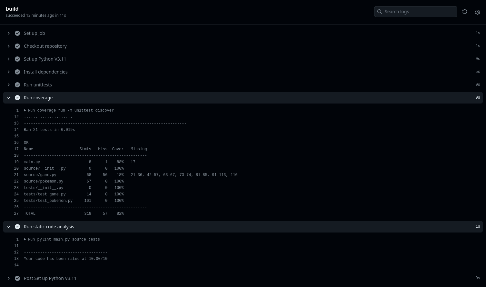

# 🏗️ Python Continuous Integration - Example 

This repo shows a basic example of CI/CD in python with github actions

## Features
- 🗒️ Static code analysis with pylint
- 🧑‍🔬 Testing with python unittest module
- ✏️ Code coverage with coverage module

## Output

---

Python Lecture for DHBW - Computer Science

🧑 Julius Wiedemann
